[TOC]

# §1.Linux环境搭建

## 1.1 Linux简单介绍

> 1946 年，第一台计算机 ENIAC 在美国宾夕法尼亚大学诞生，主要用于军工领域，最初是用于导弹的弹道计算。

> Linux是一款用C语言写的源代码公开（开源）的操作系统。

[Linux官网](https://www.kernel.org/)

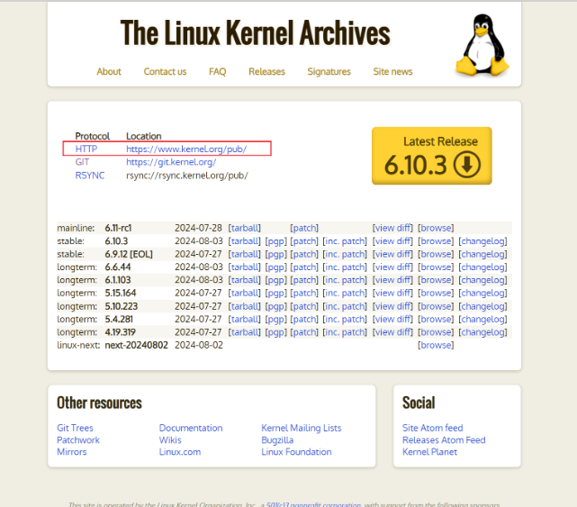

点击 HTTP 后面的网址

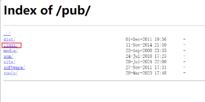

选择 Linux

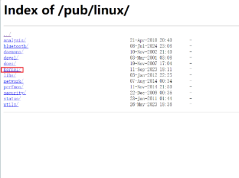

点击 kernel

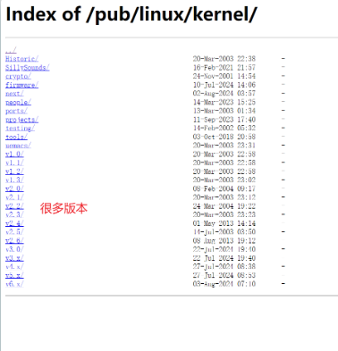

进去后发现很多版本

> 开源的大部分都是免费的。如何理解开源呢？

1. 为什么有人愿意无偿参与？

   最初是几十年前贡献开源代码的人自己不差钱；有些开源是一件改变世界的事情，比如Linux；第三点是和社会的志愿者是一类角色，世界上有很多顶级的工程师愿意参与。

2. 开源 VS 闭源

   对于开源来说，简单说优点就是集思广益，参与人数很多，有人写，有人用，有人看，有人发现问题，有人解决问题，慢慢地就会出现越来越好的代码。
   
   对于闭源来说，参与人数有限，在发现问题和解决问题的速度肯定没有开源快，效率一定没有开源高。
   
   我们从安全方面说，开源也就是所有的逻辑公开，源码之前了无秘密。

> Linux操作系统有各种各样的版本

1. 商业化发行版：Ubuntu，CentOS……

   可以看成 Linux 操作系统的品牌

2. 技术发行版：1.XXX或者2.XXX等等

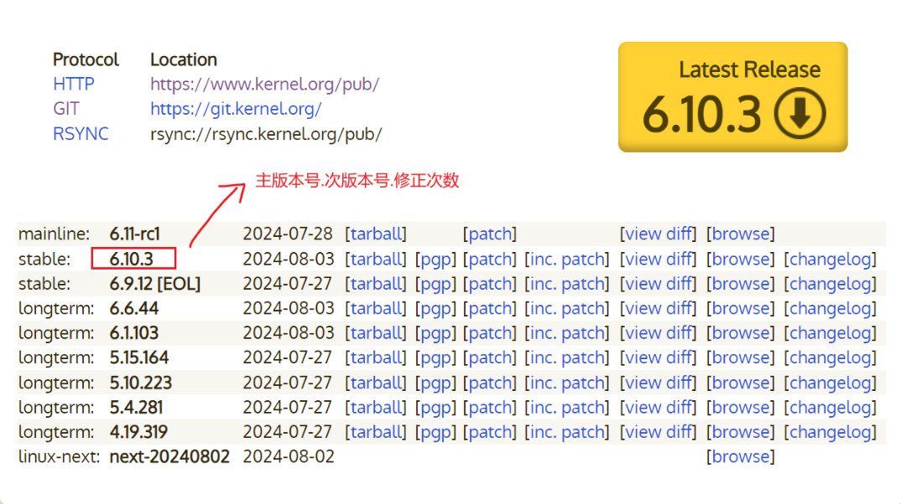

修正次数达到某个数字会向次版本号进 1，次版本号达到某个数字会向主版本号进 1。

如果次版本号是偶数，说明该版本是稳定版本。如果是奇数，表示测试版本，测试版本发出了先用一用，然后观察一段时间，没有问题再升级到偶数，就像抢先体验。

## 1.2 Linux环境搭建

> 有三种方式

1. 双系统（不推荐）

   在 Windows 再装一个系统，成本很高，在装双系统的时候 Windows 容易出问题。

2. powershell（不推荐）

3. 虚拟机 + CentOS 7 镜像

   需要下载虚拟机软件，推荐 VMware player 免费版 + CentOS 7/Ubuntu镜像文件

   网上有非常多的教程。

4. 云服务器（最推荐）

   云服务器是真正的开发和生产环境，常见的有阿里云，腾讯云，华为云以及百度云

> 购买云服务器，以腾讯云为例
>

- 选择轻量应用服务器

  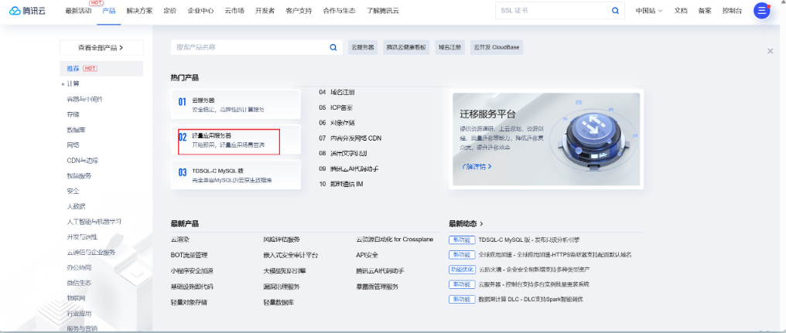

- 进入到特惠

  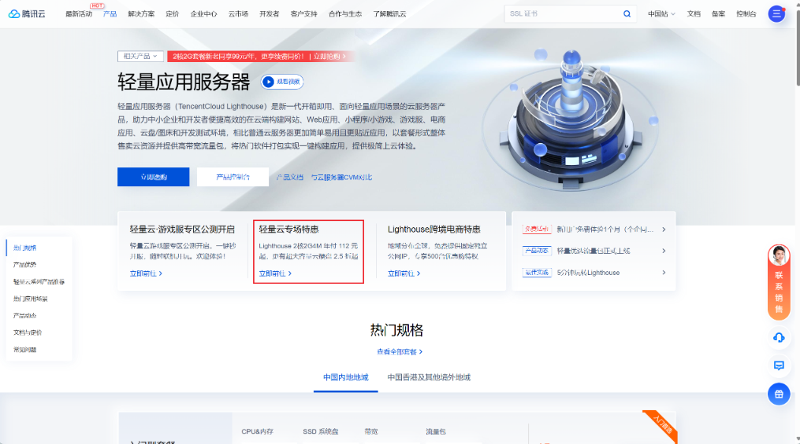

- 选择 2核2G 基本够用了，当然你也可以选择 2核4G 的

  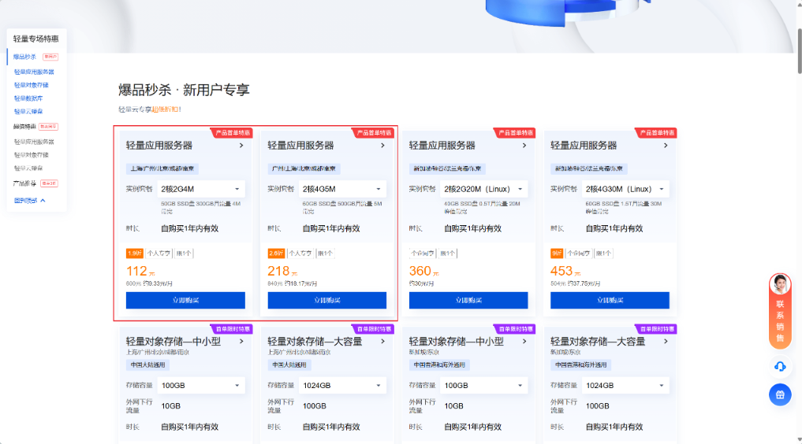

- 我购买的是 2核4G 的，进去后选择常见的 CentOS 或者 Ubuntu，由于 CentOS 停止维护，所以建议选择Ubuntu 22.04/20.04/24.04 LTS 即可。

- 购买完成后，点击右上角 控制台

  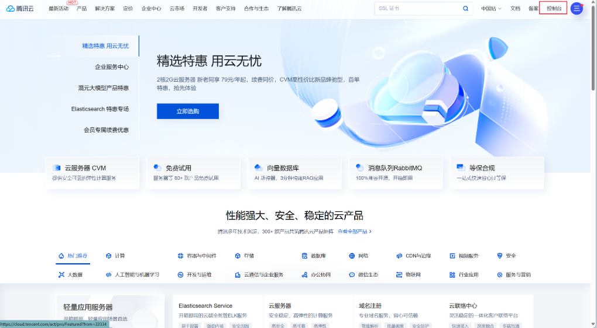

- 点击 轻量应用服务器

  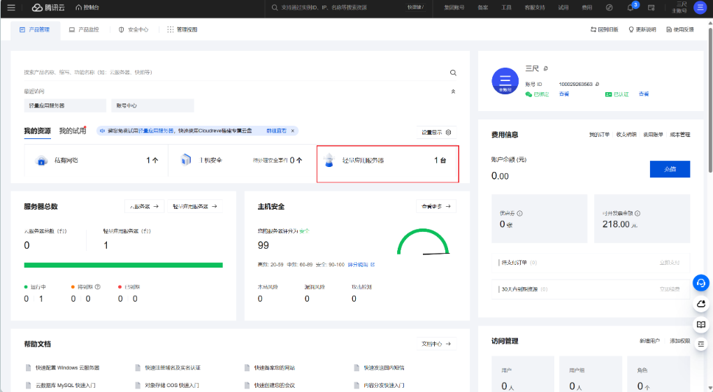

- 进去后一定要 重置密码，密码尽量复杂

  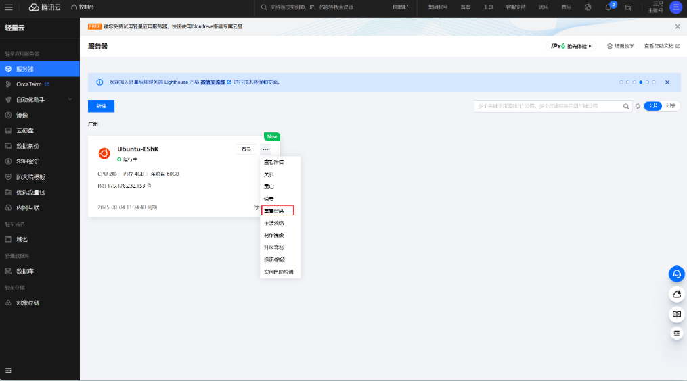

- 重置好密码后，点击确认即可

  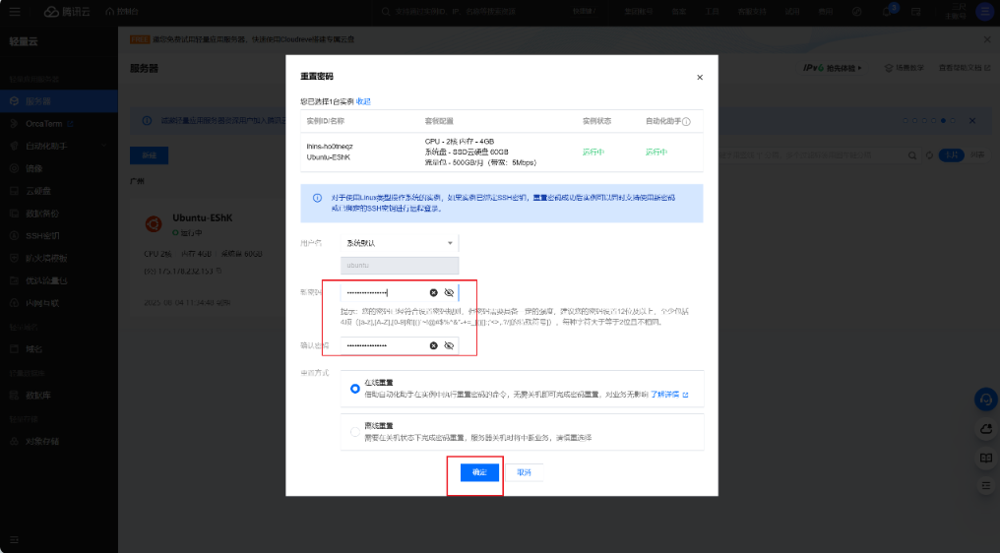

> 购买完成后，怎么样登录云服务器？

1. 复制你的公网IP

   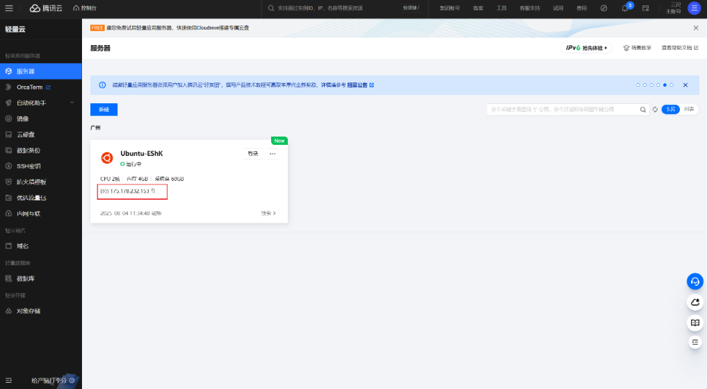

2. 下载 Xshell，选择家庭学校免费版

   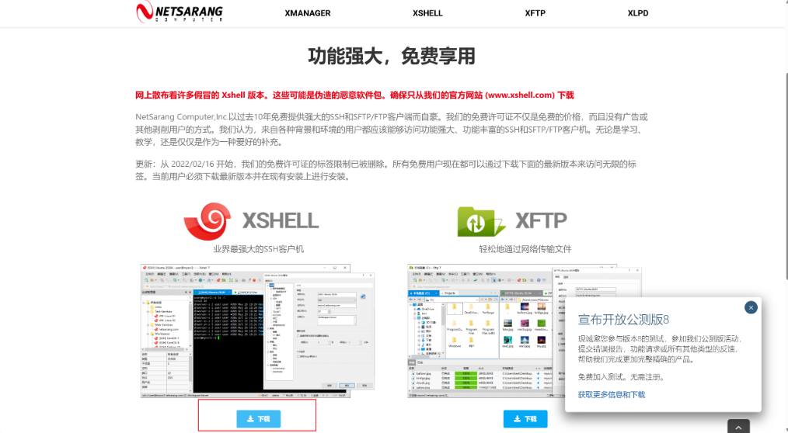

3. 安装完成后，登录云服务器，形式为ssh root@云服务器公网IP，然后回车，点击接受并保存

   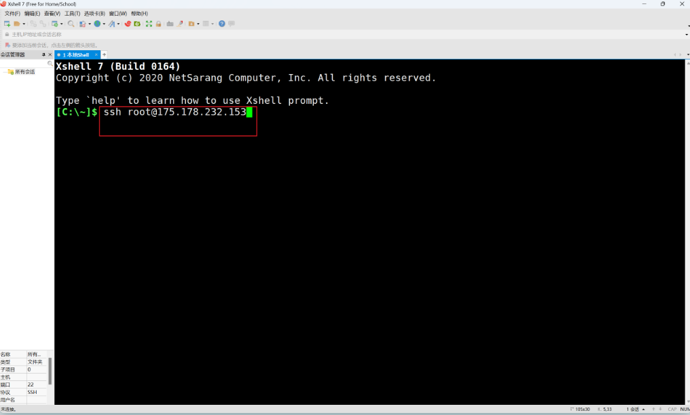

4. 出现输入密码框，密码就是前面购买云服务器后重置的密码

   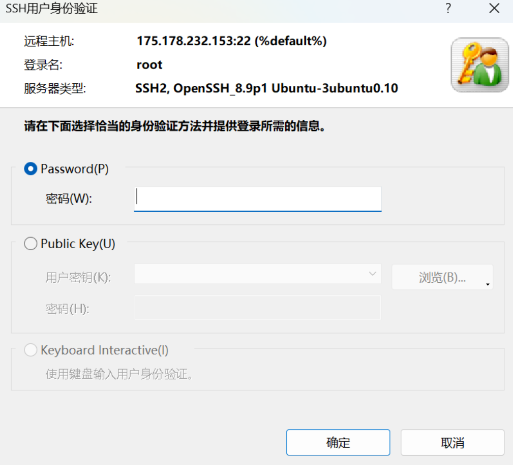

## 结语

到此环境就搭建完成了，如果你们发现文中错误或者有更好的建议与想法，欢迎留言。

