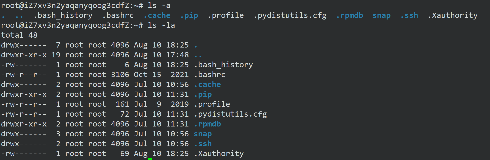
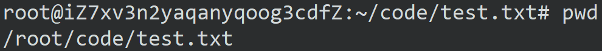
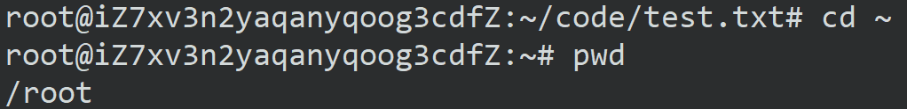
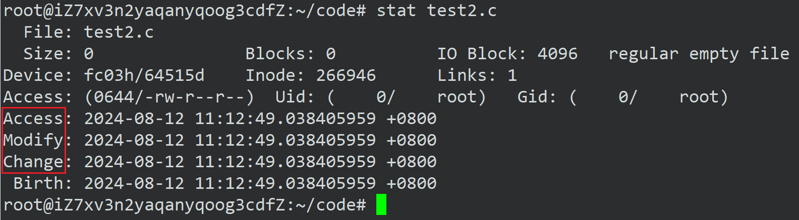
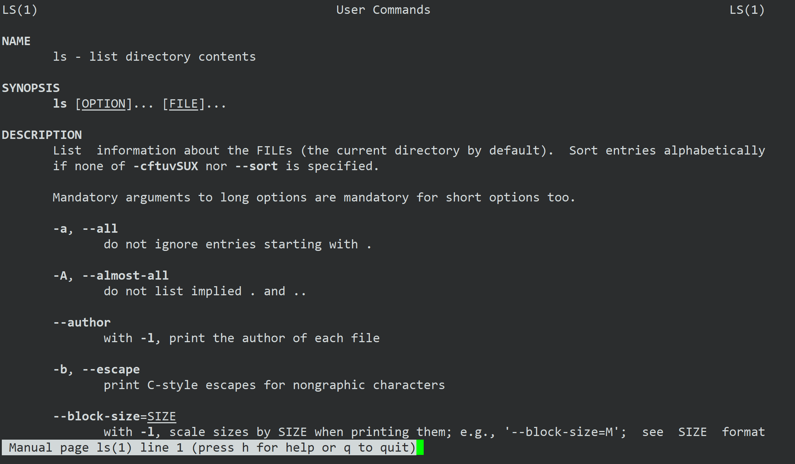

> # §2.基本指令
>

## 前言

> 使计算机更好用！这是操作系统的根本要义！

## whoami

可以查到哪个用户登录我的系统。

## who

当前有哪些用户正在我的系统当中。

## pwd

> [!IMPORTANT]
>
> 显示当前我所在的目录。`Print Working Directory`（打印工作目录）
>
> 

Windows也有这样的概念。


## ls

> [!IMPORTANT]
>
> 查看当前目录下的文件信息。list（列出文件和目录）
>
> 对于目录，该命令列出该目录下的所有子目录与文件。对于文件，将列出**文件名**。
>
> `ls -l `
>
> l 就是 list ，显示文件的属性列表，-l 不会显示隐藏文件。

> [!TIP]
>
> 问：如果在Windows上新建一个空文件，这个文件要占据磁盘空间吗？
>
> 答：一定会占据空间，虽然文件里没有任何内容，但是诸如文件名，文件的创建时间，文件类型等这些文件的属性也是数据。站在计算机的角度上它们都是二进制，也要被计算机记录和存储下来。所以不要狭隘的认为只有文件内容才占据空间。
>
> 还说明**文件 = 文件内容 + 文件属性。**
>
> 所以全部的文件操作要么对文件内容进行操作，要么对文件属性进行操作。绝对不会脱离这两种。

> [!IMPORTANT]
>
> `ls -a`
>
> 列出目录下的所有文件，包括以 . 开头的隐含文件。
>
> `ls -la`
>
> 更加详细的
>
> 

> [!TIP]
>
> `ls -la` 等价于`ls -al` 也等价于 `ls -l -a` 也等价于 `ls -a -l`，可以分开写，也可写到一起。在操作上没有任何的差别。
>
> 在Windows下面也是有隐藏的文件。
>
> 

------

除了` ls` 外，还有 `ll` 命令。

**`ll`会列出该文件下的所有文件信息，包括隐藏的文件，而`ls -l`只列出显式文件**，`ll`等价于`ls -la`（有些不一样）


## clear

清屏

## cd

> [!IMPORTANT]
>
> 更改工作目录。`change directory`（改变目录）
>
> `cd ..`	返回上级目录
>
> `cd /root/code/` 	绝对路径
>
> `cd ../code/`	相对路径
>
> `cd ~`	进入家目录
>
> `cd -`	返回最近访问目录

在Windows上想要进去一个目录，只需要使用鼠标点击即可。那么在Linux下，应该怎么进入呢？

我们先创建一个code目录，`mkdir`就是创建一个文件，后文会讲到。

```cmd
mkdir code
```

我们使用 `ls` 或者 `ls -la`查看一下，就会发现已经创建成功。


我们再使用 `pwd` 命令显示我当前所在的目录，是 `/root`。


我们再使用 `cd code`，更改目录到 `/root/code`。


我们再使用 `pwd` 查看一下当前工作目录，发现已经变到 `/root/code`。


------

Linux下的目录结构是怎么样的？

我们刚才是新建了一个 code 目录，那我们怎么改变本身已经有的文件？Windows上的C盘等等很多文件是本身就有的，通过鼠标就可以点击。

前文提到 . 开头的是隐藏文件。我们使用`ls -a` 查看隐藏文件或者 `ls -la` 查看更加详细的。发现有 **.** 和 **..** 的。这又是什么意思呢？


其中 **.** 是当前路径，**..** 是上级路径。

我们可以使用 `cd `命令来验证一下，首先使用 `cd .` 更改到当前路径，再使用` pwd `显示当前目录。


我们发现没有变化，那说明 . 就是当前路径。

我们再使用`cd ..` 回退到上级路径，再使用` pwd` 显示当前目录。 


我们发现它确实更改到上级路径了。

再`cd ..` 又回退到上一级目录了。

类似于Windows上的 左箭头。


------

> 我们经常说路径，那什么叫路径呢？

路径是引用文件和目录的方式。它给出了目录结构中文件或目录的位置。它由名称和斜杠语法组成。

```cmd
/root/code
```

```cmd
C:\Windows\Branding\Basebrd\en-US
```

上面的是Linux下的路径，下面的是Windows下的路径，我们仔细观察可以发现有个区别。一个是斜杠 ，一个是反斜杠 ，前者是Linux下的路径分隔符，后者自然就是Windows下的路径分隔符。

两个路径分隔符中间一定是目录（文件夹），最后可能是文件也可能是文件夹。

那么通俗来说，路径分隔符分隔的由一串文件夹构成的字符串叫做路径。


我们可以将 `cd .`理解为 `/root/code` 这一个路径，也可以理解为 `code` 这个文件夹。

我一直 `cd ..`，最后发现只剩一个 `/` ，继续 `cd ..` 也没法再回退了。


我们把只有 `/` 的这个东西叫做 Linux 的根目录。

我们可以看一下根目录都有哪些东西。


> [!CAUTION]
>
> 以 d 开头的就是目录。

如果我想看一下 `boot` 的内容，也就是里面有哪些东西（文件内容），可以使用命令：

```cmd
ls /boot
```

如果我是想看 `boot` 这个本身的属性（文件属性），可以使用命令：

```
ls -ld
```


> [!IMPORTANT]
>
> `-d` 将目录像文件一样显示，而不是显示其下的文件。 如：`ls –d` 指定目录，想要更详细的就是 `ls -ld`

如果我想看根目录，使用命令：

```cmd
ls -ld /
```


可见，`/ `也是一个目录。换句话说` / `也是一个文件夹。当我们 `cd ..` 回退到 `/ `就不能回退了，这个` / `就是根目录。

每个目录下又可以放更多的目录。


就跟Windows一样，每个目录下也可以放很多的目录，而不是只能放一个。

到这里，我们就对Linux整体的目录结构有一个认识了。它是一颗多叉树的样子。就跟数据结构中的树是一样的。

> [!IMPORTANT]
>
> 1. 这棵树的叶子节点一定是普通文件或者是空目录。
> 2. 路上节点，也就是非叶子节点一定是目录
> 3. 访问一个文件的本质需要先找到它，找到文件的本质就是在多叉树中进行节点的查找。
> 4. 路径的本质就是多叉树的搜索路径。

> 为什么要有路径呢？

无论是叶子节点还是路上节点，往上走它都只有一个父节点，所以从根目录到该目录，这条路径具有唯一性。可以帮助我们在系统中快速找到文件。

> [!Note]
>
> 几乎所有的操作系统，文件夹或者目录结构都是树状结构。

不是只能一级一级回退或者进入到下一级。可以`cd 目录`直接到达你想找的目录。跟Windows也是一样的。只不过没有图形化界面。


> [!IMPORTANT]
>
> - 从根目录开始，定位一个文件的路径，叫做绝对路径。无论在哪都能唯一定位一个文件。配置文件中常用
> - 相对于自身当前所处的目录为参考点，定位一个文件的路径，叫做相对路径。与当前目录强相关。适合命令行场景。

------

> 怎么证明是树状结构？

`tree`命令。如果`tree`命令没用的话，可能是你的系统中没有安装 `tree`，一般情况默认也是没有安装的，如果你是`Ubuntu`使用安装命令：

```cmd
sudo apt-get install tree
```

如果是 `CentOS`使用安装命令：

```
yum install tree -y
```


可以看到我的系统中 `root`目录下有七个目录，它是以树形结构呈现的。也可以查看根目录的树形结构，不过根目录有很多目录。


除了使用`tree .`命令查看当前目录的树形结构，也可以使用`tree 目录`查看指定目录的树形结构。

> [!NOTE]
>
> `cd`命令后面跟绝对路径或者相对路径即可。
>
> ```cmd
> cd 绝对路径或者相对路径
> ```

> [!TIP]
>
> cd 的其他操作
>
> - `cd -`：跳转最近一次所处的目录。
>
> 
>
> Windows中 `Alt+Tab`，快速在两个界面跳转。
>
> - `cd ~`：进入家目录
>
> 在Linux中，一类是 root 用户，一类是其他用户。
>
> 如果是 root 用户，家目录就是 /root，如果是普通用户，家目录可能是 /home/xxx，也可能是 /root
>
> 
>
> 我现在在这个目录下面，我使用 `cd ~` 命令:
>
> 

------

> 什么是家目录？

在Windows中，家目录是这样的


我们点击进去后发现一个桌面：


在Windows中，虽然有桌面的概念，但桌面本质上也是一个目录或者叫文件夹。只不过用户登录的时候，家目录里面有桌面的文件夹，Windows把这个文件夹中的所有文件(夹)，以图标的形式展示在显示器上。如果是在虚拟机上是可以看见的。


我们看到我桌面上什么都没有。


我现在在家目录中


进入到桌面目录。

使用命令：

```cmd
touch test.c
```

在桌面创建一个 test.c 的文件。


> [!NOTE]
>
> 登录的时候，默认登录所处的目录就是当前登录用户的家目录。

> [!TIP]
>
> 建议自己写的代码，创建的各种文件都统一放在自己的家目录下。

## touch

> 我在前面使用了一个 touch 命令创建 test.c 文件。

创建普通文件，比如 test1.txt，test2.c，test3


这个目录下面没有什么文件，我尝试创建一个 test1.txt 文件。


已经成功创建了。

也可以同时创建多个文件或者文件夹。比如我要同时创建 test2.c 和 test3 和 test4.cpp 。中间只需要用空格隔开就行。


------

> [!NOTE]
>
> 还有一个命令叫做 `stat` 可以查看文件更详细的属性信息。



我们看到这里有三个时间，简称为 ACM 时间。它们分别表示什么呢？

Access 表示最后一次访问文件的时间。

Modify 表示最后一次修改文件内容的时间。

Change 表示最后一次改变文件属性的时间。


## mkdir

> 前文说到 touch 是创建一个文件，**mkdir则是在当前目录下创建一个目录 。**

> [!IMPORTANT]
>
> -p, --parents 可以是一个路径名称。此时若路径中的某些目录尚不存在,加上此选项后,系统将自动建立好那些尚不存在的目录，即一次可以建立多个目录。

它只能在当前目录下创建一个目录，不能连续创建路径，比如：


那么我们需要这样创建应该怎么创建呢？

可以使用下面命令递归创建多个目录：

```cmd
mkdir -p dir1/dir2/dir3
```


我们使用 tree 命令可以清楚地看到已经创建好了。

如果我想看 dir1 里面的内容使用命令：

```cmd
ls dir1
```


如果想要更详细，使用命令：

```cmd
ls -la dir1
```


如果我是想看 dir1 本身的话，使用命令：

```cmd
ls -d dir1
```


如果想要更详细，使用命令：

```cmd
ls -ld dir1
```


> [!NOTE]
>
> -d 不进入这个目录，只是把这个目录本身的属性显示出来。

------

**通过键盘的上下键可以快速翻阅历史命令。**

------

## rmdir 和 rm

> [!IMPORTANT]
>
> `rmdir` 是一个与 `mkdir` 相对应的命令。`mkdir` 是建立目录，而 `rmdir` 是删除命令。只不过 `rmdir`只能删除空目录。

> 我们一般使用 `rm`命令，它的功能也是删除文件或目录。

- -f 即使文件属性为只读(即写保护)，也直接删除，强制删除 

- -i 删除前逐一询问确认 

- -r 删除目录及其下所有文件

如果使用 `rm -r`可以删除目录及其所有文件。有的机器或者系统需要一次一次递归进去，选择 yes 或 no，一次一次删除，则可以使用`re -rf`达到一次性删除的结果。（r：recursion递归，f：force强制）

> [!WARNING]
>
> 千万不要使用 `rm -r`或者`rm -rf`删除根目录，很有可能把系统干瘫了，如果你还是个管理员，那基本上就是把能删的都删了。并且没有办法恢复。如果你是新装的系统，里面啥也没有，你可以试试，系统瘫了，去云服务器后台点开云服务器实例，重装系统几分钟就好了。

> [!TIP]
>
> `rm -r *`表示删除当前目录所有文件， * 是通配符，并且默认不删除隐藏文件。

## man

> Linux的命令有很多参数，我们不可能全记住，我们可以通过查看联机手册获取帮助。

比如使用命令：

```cmd
man ls
```



输入 q 退出。

使用 `man man`命令可以查看手册。


总共有9个手册。

1 手册是可执行程序或 shell 命令也就是普通命令，2手册是系统函数，3手册是库函数。

比如`ls`命令是属于 1 手册里的命令。可以使用命令：

```cmd
man 1 ls
```

默认 man命令 会从 1 手册依次往下查询，如果 1 手册中有则告诉你，1 手册中没有则查询 2 手册，2手册没有继续查询 3 手册，依次往下查询直至找到。

比如我们要找 printf，使用命令：

```cmd
man printf
```


这个左上角括号里的数字，表示的就是哪一个手册。这里显示 1，表示 1 手册。

我们说 printf 不是C语言的库函数吗？它应该在 3 手册中，怎么会在 1 手册中。

其实 printf 在 1 手册和 3 手册都有，在 1 手册中是 shell 命令，在 3 手册中是库函数。

默认是从 1 ~ 9 手册依次查询，在 1 中找到就直接返回。**如果就是要查 3 手册中的 printf，只需要在命令前加上手册编号即可**，就拿 printf 来说，它默认查询的结果是 1 手册，我想要 3 手册中的，要使用命令：

```cmd
man 3 printf
```


> [!NOTE]
>
> man 手册编号 查找的内容

> [!TIP]
>
> 有时候没有安装man？
>
> 在 root账号使用命令：
>
> ```cmd
> yum install -y man-pages
> ```
>
> 环境一般最少分为开发环境，测试环境和生产环境。生产环境是真实线上环境，我们写完，测完，真正给用户提供服务的环境。比如游戏更新，对局。一般是非常干净的操作系统，**不会安装和开发强相关的工具**等。

## cp

> copy 复制文件或目录

> [!IMPORTANT]
>
> cp 源文件或目录 目标文件或目录

同级目录下不允许存在同名文件或者同名目录。

```cmd
nano file.txt
```

`nano`相当于Windows下的记事本。

打开后我们就可以子在里面写东西了。


我们发现下面都是 ^G， ^X， ^O等等，这个 ^ 就是 ctrl 键，我们按 ctrl + x 退出。


它问你保存吗？Y 保存， N 不保存，ctrl + c返回记事本。

如果没有 nano，使用安装命令：

```cmd
yum install -y nano
```

把文件保存到 code 文件夹下面：


使用命令将 file.txt 文件复制到上级目录下，也就是 root 目录下：

```cmd
cp file.txt ..
```


前文说到同级目录下不允许存在同名文件，也就说明不能将文件拷贝到当前目录。如果非要拷贝一份，可以是备份文件，使用命令：

```cmd
cp file.txt file.txt.bak
```

**-rf 是通用的， cp 命令，一次默认拷贝一个文件，想要将当前目录下的文件全部拷贝，需要使用`cp -rf 当前目录 目的目录` **

## mv

mv命令是move的缩写，可以用来移动文件或者将文件改名。

> [!IMPORTANT]
>
> 

mv 源文件或目录 目标文件或目录。

1. 视mv命令中第二个参数类型的不同（是目标文件还是目标目录），mv命令将文件重命名或将其移至一个新的目录中。  
2. 当第二个参数类型是文件时，mv命令完成文件重命名，此时，源文件只能有一个（也可以是源目录名），它将所给的源文件或目录重命名为给定的目标文件名。
3. 当第二个参数是已存在的目录名称时，源文件或目录参数可以有多个，mv命令将各参数指定的源文件均移至目标目录中。


> [!NOTE]
>
> 简单说，就是将前面的移动到后面的，如果是同一个目录可以同时重命名，所以不冲突。
>
> ```cmd
> mv /root/code/file.txt /root/code/dir
> ```
>
> 正常情况是将当前目录移动到其他目录下面
>
> ```cmd
> mv /root/code/dir /root
> ```

- 将文件改名

  ```cmd
  mv dir1 dir2
  ```

- 移动并重命名

  ```cmd
  mv  /root/code/file.txt   /root/file2.txt
  ```


## cat

> [!IMPORTANT]
>
> 查看目标文件的内容。
>
> -n 对输出的所有行编号
>
> -s 不输出多行空行
>
> -b 对非空输出行编号


> [!TIP]
>
> 如果使用`tac`，也就是把 cat 反向写，会将内容逆向输出。

## echo

echo 可以直接将内容显示出来。比如：

```cmd
echo "Hello World!"
```

写入文件：

```cmd
echo "Hello World!" > hello.txt
```

将 Hello World！ 写入 hello.txt 文件中，如果没有 hello.txt 文件，会自动创建。

> [!IMPORTANT]
>
> echo "Hello World!" 默认向显示器打印。
>
> 如果加`>`就变成了向文件内部写入。
>
> 本来应该打印到显示器上，结果被写入了文件中，这叫做重定向。

其实显示器打印，就是写入显示器。

大部分的硬件设备，都可以看作有读写方法，只不过有些方法可以为空。

**Linux下一切皆文件**。做任何事视角统一，Linux系统的编码维护成本就降低了。

echo "Hello World!" 向显示器进行文件写入。上面写的例子是**输出重定向**。

```cmd
> test.txt
```

> [!CAUTION]
>
> 我们没有内容重定向到 test.txt文件中，但是已经进行重定向了。所以我们可以使用这样的方式进行文件的创建，同样可以清空文件。
>
> 输出重定向，不会保存上次结果，会将我们上次的结果清理掉，然后再写入。


> [!NOTE]
>
> 两个作用：
>
> 1. 新建空文件
> 2. 清空目标文件

> 如果我想不断向里面新增，应该怎么办？

```cmd
echo "Hello World" >> hello.txt
```

> [!NOTE]
>
> 两个大于号，则不会清空上次的内容，向里面增加内容。把 `>>`称为追加重定向。


------

> cat 的其他用法

直接cat回车，输入什么打印什么

cat 从键盘文件读取什么，就向显示器写入什么

默认读取的时候，是从键盘文件中输入的。

如果把键盘文件更换成其他文件

```cmd
cat < hello.txt
```

把本来应该从键盘文件中读入的内容，更改为从普通文件中进行输入，称为输入重定向。

> cat 用途：用来打印短小的文件

## more

> [!IMPORTANT]
>
> 功能类似 cat   
>
> - -n 对输出的所有行编号  
>
> - q 退出more 


## less

less 工具也是对文件或其它输出进行分页显示的工具，应该说是 Linux 正统查看文件内容的工具，功能极其强大。 less 的用法比起 more 更加的有弹性。在 more 的时候，我们并没有办法向前面翻，只能往后面 但若使用了 less 时，就可以使用 pageup ，pagedown 等按键的功能来往前往后翻看文件，更容易用来查看一个文件的内容！除此之外，在 less 里头可以拥有更多的搜索功能，不止可以向下搜，也可以向上搜。

> [!IMPORTANT]
>
> less与more类似，但使用less可以随意浏览文件，而more仅能向前移动，却不能向后移动，而且less在查看之前不会加载整个文件。
>
> - -i  忽略搜索时的大小写 
>
> - -N 显示每行的行号  
> - /字符串：向下搜索“字符串”的功能  
> - ?字符串：向上搜索“字符串”的功能  
> - n：重复前一个搜索（与 / 或 ? 有关）  
> - N：反向重复前一个搜索（与 / 或 ? 有关）  
> - q：quit 

## head

head 与 tail 就像它的名字一样的浅显易懂，它是用来显示开头或结尾某个数量的文字区块，head 用来显示档案的开头至标准输出中，而 tail 就是看档案的结尾。

> [!IMPORTANT]
>
> head 用来显示档案的开头至标准输出中，默认head命令打印其相应文件的开头10行。  
>
> - -n	n表示行数


## tail

tail 命令从指定点开始将文件写到标准输出。使用tail命令的 -f 选项可以方便的查阅正在改变的日志文件，tail -f filename 会把 filename 里最尾部的内容显示在屏幕上，并且不断刷新，使你看到最新的文件内容。  

> [!IMPORTANT]
>
> 用于显示指定文件末尾内容，不指定文件时，作为输入信息进行处理。常用查看日志文件。  
>
> - -f 循环读取
>
> - -n	n表示行数
>
> 

> head 和 tail 分别查看首尾，如果想提取文件中间部分怎么办？

比如我文件 file.txt 有十万行，我想要看中间 50000 - 50010 行。

先提取前 50010 行：

```cmd
head -50010 file.txt
```

然后将前 50010 行重定向到临时文件 tmp.txt 文件中

```cmd
head -50010 file.txt > tmp.txt
```

其次在 tmp.txt 文件中提取最后十行，也就是 file.txt 文件中的 50000 - 50010

```cmd
tail -10 tmp.txt
```

虽然这样做法完全可行，但是毕竟要生成临时文件。

优雅的做法：

```cmd
head -50010 file.txt | tail -10
```

这个 `|`称为命令行管道。在生活中，我们有天然气管道等，管道的作用就是传输资源。在计算机中，最重要的资源是数据，管道一定有入口和出口。可以理解为基于`|` 前的命令执行`|`后的命令。同样可以进行多个命令的联合，比如我想在这个基础上进行逆向并提取前3行：

```cmd
head -50010 file.txt | tail - 10 | tac | head -3
```

## 结语

不用太过于担心记不住指令，在后续的学习中因为没有图形化界面（在公司中真正的开发环境也是没有图形化界面，这就是最推荐购买云服务器的原因），肯定有越来越多的写指令的机会，熟能生巧。

## 练习题

1. 哪个命令是输出Linux内核版本信息（）

   A. uname -r

   B. vmstat

   C. sar

   D. stat

   解析：A

   uname -r 	查看linux内核版本信息

   vmstat 	报告关于内核线程、虚拟内存、磁盘、陷阱和 CPU 活动的统计信息

   sar			主要帮助我们掌握系统资源的使用情况，特别是内存和CPU的使用情况

   stat		用于显示文件的状态信息

2. Linux有三个查看文件内容的命令，如果希望在查看文件内容过程中可以通过光标上下移动来查看文件内容，应使用命令（）

   A. cat

   B. more

   C. less

   D. menu

   解析：C

   A	cat 打印文件内容到终端显示

   B	more	分页显示文件内容，但是通常向上翻页不好使

   C	less	分页显示文件内容，可以灵活上下移动光标和翻页

   D	menu	没有这个指令（至少centos7上默认没有这个命令）

3. 在使用 mkdir 创建新的目录时，在父目录不存在时先创建父目录的命令是（）

   A. -m

   B. -d

   C. -f

   D. -p

   解析：D

   A	-m	在创建目录的同时设置权限

   B	-d	没有这个选项

   C	-f	没有这个选项

   D	-p	在创建多层级目录的时候若上级目录不存在则创建

4. 在Linux系统中，想要找到try_grep含有以a为行开头的内容，使用命令（）

   A. grep -E #$ try_grep

   B. grep -E #a try_grep

   C. grep -E ^$ try_grep

   D. grep -E ^a try_frep

   解析：D

   grep选项中，-E选项可以用来扩展选项为正则表达式；

   $表示匹配文件末尾，字符需要在$之前表示以字符结尾 a$表示以a结尾

   ^表示匹配文件起始，字符需要在^之后表示以字符起始 ^a表示以a起始

5. Linxu查看CPU占用命令的是什么（）

   A. top

   B. netstat

   C. free

   D. df

   解析：A

   A	top 		查看cpu资源使用状态

   B	netstat		查看网络连接状态

   C	free		查看内存资源状态

   D	df			查看磁盘分区资源状态

6. 批量删除当前目录下后缀名为 .c 的文件，应使用命令（）

   A. rm * .c

   B. find . -name "*.c" -maxdepth 1 | xargs rm

   C. find . -name "*.c" | xargs rm 

   D. 以上都不正确

   解析：AB

   A	rm * .c ，*是通配符，表示匹配任意字符任意次

   B	find . -name "*.c" -maxdepth 1 | xargs rm 

   ​		find . -name "*.c" -maxdepth 1 找到当前目录下.c结尾的文件，目录深度为1

   ​		xargs是一个强有力的命令，它能够捕获一个命令的输出，然后传递给另外一个命令，用于很多不支持 | 管道来传递参数的命令

   ​		相当于将前边命令的执行结果，也就是查找到的文件名，传递给后边的rm指令进行删除

   C	find . -name "*.c" | xargs rm 没有进行深度控制，删除的不仅是当前目录下的文件，会将子目录下的文件也删除

   D	以上都不正确
