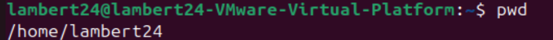

# §2.基本指令

## 前言

> 使计算机更好用！这是操作系统的根本要义！

## whoami

可以查到哪个用户登录我的系统。

## who

当前有哪些用户正在我的系统当中。

## pwd

> [!IMPORTANT]
>
> 显示当前我所在的目录。`Print Working Directory`（打印工作目录）
>
> 

Windows也有这样的概念。


## ls

> [!IMPORTANT]
>
> 查看当前目录下的文件信息。list（列出文件和目录）
>
> 对于目录，该命令列出该目录下的所有子目录与文件。对于文件，将列出**文件名**。
>
> `ls -l `
>
> l 就是 list ，显示文件的属性列表。

> [!TIP]
>
> 问：如果在Windows上新建一个空文件，这个文件要占据磁盘空间吗？
>
> 答：一定会占据空间，虽然文件里没有任何内容，但是诸如文件名，文件的创建时间，文件类型等这些文件的属性也是数据。站在计算机的角度上它们都是二进制，也要被计算机记录和存储下来。所以不要狭隘的认为只有文件内容才占据空间。
>
> 还说明**文件 = 文件内容 + 文件属性。**
>
> 所以全部的文件操作要么对文件内容进行操作，要么对文件属性进行操作。绝对不会脱离这两种。

> [!IMPORTANT]
>
> `ls -a`
>
> 列出目录下的所有文件，包括以 . 开头的隐含文件，那么也就说明 -l 不会显示隐藏文件。
>
> `ls -la`
>
> 更加详细的
>
> 

> [!TIP]
>
> `ls -la` 等价于`ls -al` 也等价于 `ls -l -a` 也等价于 `ls -a -l`，可以分开写，也可写到一起。在操作上没有任何的差别。
>
> 在Windows下面也是有隐藏的文件。
>
> 

------

除了` ls` 外，还有 `ll` 命令。

**`ll`会列出该文件下的所有文件信息，包括隐藏的文件，而`ls -l`只列出显式文件**，`ll`等价于`ls -la`


## clear

清屏

## cd

> [!IMPORTANT]
>
> 更改工作目录。`change directory`（改变目录）

在Windows上想要进去一个目录，只需要使用鼠标点击即可。那么在Linux下，应该怎么进入呢？

我们先创建一个code目录，`mkdir`后文会说到。

```cmd
mkdir code
```

我们使用 `ls` 或者 `ls -la`查看一下，就会发现已经创建成功。


我们再使用 `pwd` 命令显示我当前所在的目录，是 `/root`。


我们再使用 `cd code`，更改目录到 `/root/code`。


我们再使用 `pwd` 查看一下当前工作目录，发现已经变到 `/root/code`。


------

Linux下的目录结构是怎么样的？

我们刚才是新建了一个 code 目录，那我们怎么改变本身已经有的文件？Windows上的C盘等等很多文件是本身就有的，通过鼠标就可以点击。

前文提到 . 开头的是隐藏文件。我们使用`ls -a` 查看隐藏文件或者 `ls -la` 查看更加详细的。发现有 **.** 和 **..** 的。这又是什么意思呢？


其中 **.** 是当前路径，**..** 是上级路径。

我们可以使用 `cd `命令来验证一下，首先使用 `cd .` 更改到当前路径，再使用` pwd `显示当前目录。


我们发现没有变化，那说明 . 就是当前路径。

我们再使用`cd ..` 回退到上级路径，再使用` pwd` 显示当前目录。 


我们发现它确实更改到上级路径了。

再`cd ..` 又回退到上一级目录了。

类似于Windows上的 左箭头。


------

> 我们经常说路径，那什么叫路径呢？

路径是引用文件和目录的方式。它给出了目录结构中文件或目录的位置。它由名称和斜杠语法组成。

```cmd
/root/code
```

```cmd
C:\Windows\Branding\Basebrd\en-US
```

上面的是Linux下的路径，下面的是Windows下的路径，我们仔细观察可以发现有个区别。一个是斜杠 ，一个是反斜杠 ，前者是Linux下的路径分隔符，后者自然就是Windows下的路径分隔符。

两个路径分隔符中间一定是目录（文件夹），最后可能是文件也可能是文件夹。

那么通俗来说，路径分隔符分隔的由一串文件夹构成的字符串叫做路径。


我们可以将 `cd .`理解为 `/root/code` 这一个路径，也可以理解为 `code` 这个文件夹。

我一直 `cd ..`，最后发现只剩一个 `/` ，继续 `cd ..` 也没法再回退了。


我们把只有 `/` 的这个东西叫做 Linux 的根目录。

我们可以看一下根目录都有哪些东西。


> [!CAUTION]
>
> 以 d 开头的就是目录。

如果我想看一下 `boot` 的内容，也就是里面有哪些东西（文件内容），可以使用命令：

```cmd
ls /boot
```

如果我是想看 `boot` 这个本身的属性（文件属性），可以使用命令：

```
ls -ld
```


> [!IMPORTANT]
>
> `-d` 将目录像文件一样显示，而不是显示其下的文件。 如：`ls –d` 指定目录，想要更详细的就是 `ls -ld`

如果我想看根目录，使用命令：

```cmd
ls -ld /
```


可见，`/ `也是一个目录。换句话说` / `也是一个文件夹。当我们 `cd ..` 回退到 `/ `就不能回退了，这个` / `就是根目录。

每个目录下又可以放更多的目录。


就跟Windows一样，每个目录下也可以放很多的目录，而不是只能放一个。

到这里，我们就对Linux整体的目录结构有一个认识了。它是一颗多叉树的样子。就跟数据结构中的树是一样的。

> [!IMPORTANT]
>
> 1. 这棵树的叶子节点一定是普通文件或者是空目录。
> 2. 路上节点，也就是非叶子节点一定是目录
> 3. 访问一个文件的本质需要先找到它，找到文件的本质就是在多叉树中进行节点的查找。
> 4. 路径的本质就是多叉树的搜索路径。

> 为什么要有路径呢？

无论是叶子节点还是路上节点，往上走它都只有一个父节点，所以从根目录到该目录，这条路径具有唯一性。可以帮助我们在系统中快速找到文件。

> [!Note]
>
> 几乎所有的操作系统，文件夹或者目录结构都是树状结构。

不是只能一级一级回退或者进入到下一级。可以`cd 目录`直接到达你想找的目录。跟Windows也是一样的。只不过没有图形化界面。


> [!IMPORTANT]
>
> - 从根目录开始，定位一个文件的路径，叫做绝对路径。无论在哪都能唯一定位一个文件。配置文件中常用
> - 相对于自身当前所处的目录为参考点，定位一个文件的路径，叫做相对路径。与当前目录强相关。适合命令行场景。

------

> 怎么证明是树状结构？

`tree`命令。如果`tree`命令没用的话，可能是你的系统中没有安装 `tree`，一般情况默认也是没有安装的，使用安装命令：

```cmd
sudo apt-get install tree
```

或者

```
yum install tree -y
```

看你是什么系统，如果你是`Ubuntu`，使用上面命令安装 `tree`，如果是 `CentOS`，则使用下面命令。


可以看到我的系统中 `root`目录下有七个目录，它是以树形结构呈现的。也可以查看根目录的树形结构，不过根目录有很多目录。


除了使用`tree .`命令查看当前目录的树形结构，也可以使用`tree 目录`查看指定目录的树形结构。

> [!NOTE]
>
> 简单总结，`cd`命令后面跟绝对路径或者相对路径即可。
>
> ```cmd
> cd 绝对路径或者相对路径
> ```

> [!TIP]
>
> cd 的其他操作
>
> - `cd -`：跳转最近一次所处的目录。
>
> 
>
> Windows中 `Alt+Tab`，快速在两个界面跳转。
>
> - `cd ~`：进入家目录
>
> 在Linux中，一类是 root 用户，一类是其他用户。
>
> 如果是 root 用户，家目录就是 /root，如果是普通用户，家目录可能是 /home/xxx，也可能是 /root
>
> 
>
> 我现在在这个目录下面，我是用 `cd ~` 命令:
>
> 

------

> 什么是家目录？

在Windows中，家目录是这样的


我们点击进去后发现一个桌面：


在Windows中，虽然有桌面的概念，但桌面本质上也是一个目录或者叫文件夹。只不过用户登录的时候，家目录里面有桌面的文件夹，Windows把这个文件夹中的所有文件(夹)，以图标的形式展示在显示器上。如果是在虚拟机上是可以看见的。


我们看到我桌面上什么都没有。



我现在在家目录中


进入到桌面目录。

使用命令：

```cmd
touch test.c
```

在桌面创建一个 test.c 的文件。


确实创建成功了。

> [!NOTE]
>
> 登录的时候，默认登录所处的目录就是当前登录用户的家目录。

> [!TIP]
>
> 建议自己写的代码，创建的各种文件都统一放在自己的家目录下。

## touch

> 我在前面使用了一个 touch 命令创建 test.c 文件。那么它是不是

- 创建普通文件，比如 test1.txt，test2.c，test3

  

  这个目录下面没有什么文件，我尝试创建一个 test1.txt 文件。

  

  已经成功创建了。

  也可以同时创建多个文件或者文件夹。比如我要同时创建 test2.c 和 test3 和 test4.cpp 。中间只需要用空格隔开就行。

  

  ------

  > [!NOTE]
  >
  > 还有一个命令叫做 `stat` 可以查看文件更详细的属性信息。

  

  我们看到这里有三个时间，简称为 ACM 时间。它们分别表示什么呢？

  Access 表示最后一次访问文件的时间。

  Modify 表示最后一次修改文件内容的时间。

  Change 表示最后一次改变文件属性的时间。

  

  ## mkdir

  > 前文说到 touch 是创建一个文件
  
  **mkdir是在当前目录下创建一个目录 。**
  
  它只能在当前目录下创建一个目录，不能连续创建路径，比如：
  
  
  
  那么我们需要这样创建应该怎么创建呢？
  
  可以使用命令：
  
  ```cmd
  mkdir -p dir1/dir2/dir3
  ```
  
  
  
  我们使用 tree 命令可以清楚地看到已经创建好了。
  
  如果我想看 dir1 里面的内容使用命令：
  
  ```cmd
  ls dir1
  ```
  
  
  
  如果想要更详细，使用命令：
  
  ```cmd
  ls -la dir1
  ```
  
  
  
  如果我是想看 dir1 本身的话，使用命令：
  
  ```cmd
  ls -d dir1
  ```
  
  
  
  如果想要更详细，使用命令：
  
  ```cmd
  ls -ld dir1
  ```
  
  
  
  > [!NOTE]
  >
  > -d 不进入这个目录，只是把这个目录本身的属性显示出来。
  
  ------
  
  **通过键盘的上下键可以快速翻阅历史命令。**
  
  ------
  
  ## rmdir 和 rm
  
  - `rmdir` 是一个与 `mkdir` 相对应的命令。`mkdir` 是建立目录，而 `rmdir` 是删除命令。只不过 `rmdir`只能删除空目录。
  
  - 我们一般使用 `rm`命令，它的功能也是删除文件或目录。
  
    > [!IMPORTANT]
    >
    > 如果使用 `rm -r`可以删除目录及其所有文件。有的机器或者系统需要一次一次递归进去，选择 yes 或 no，一次一次删除（`rm -i`：删除前逐一询问），则可以使用`re -rf`达到一次性删除的结果。（r：recursion递归，f：force强制）
  
  > [!WARNING]
  >
  > 千万不要使用 `rm -r`或者`rm -rf`删除根目录，很有可能把系统干瘫了，而且你还是个管理员。基本上就是把能删的都删了。并且没有办法恢复。如果你是新装的系统，里面啥也没有，你可以试试，系统瘫了，去云服务器后台点开云服务器实例，重装系统几分钟就好了。
  
  > [!TIP]
  >
  > `rm -r *`表示删除当前目录所有文件， * 是通配符，并且默认不删除隐藏文件。
  
  

## man
